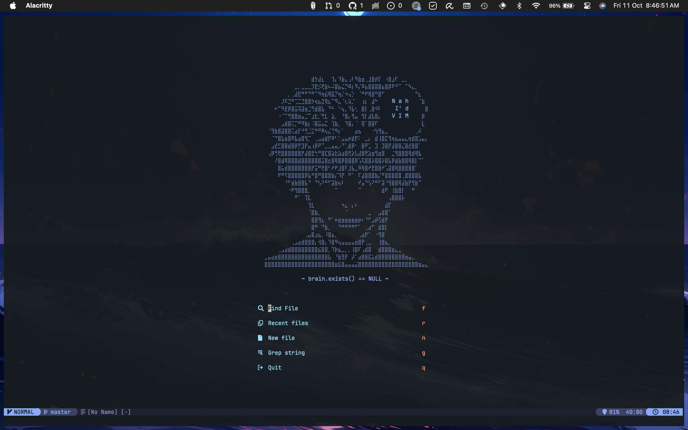
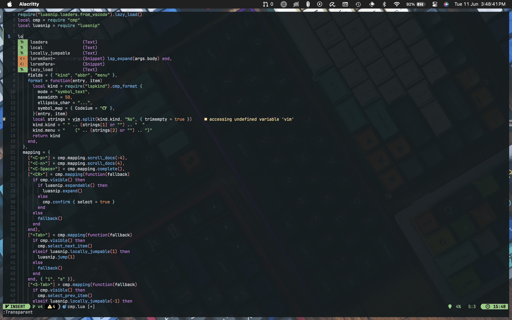
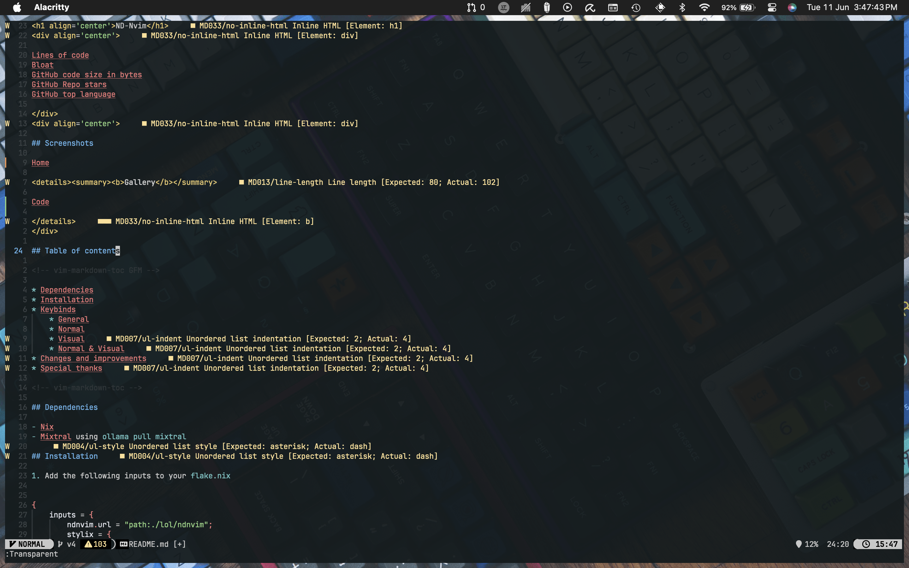
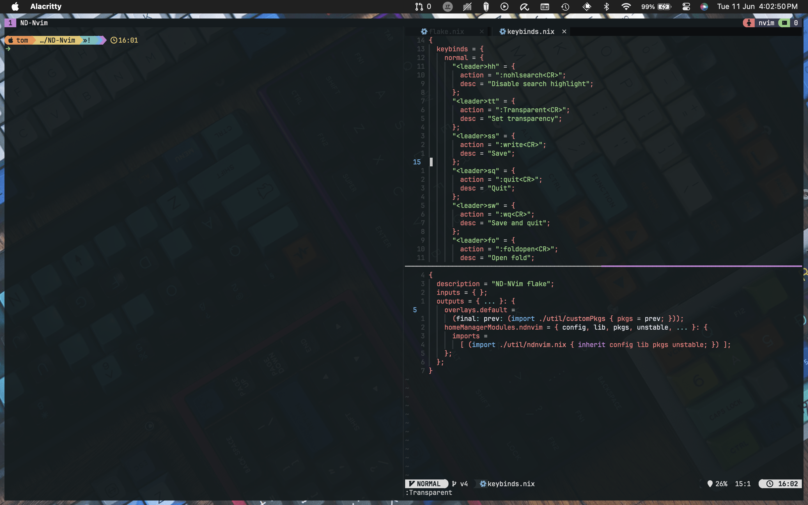
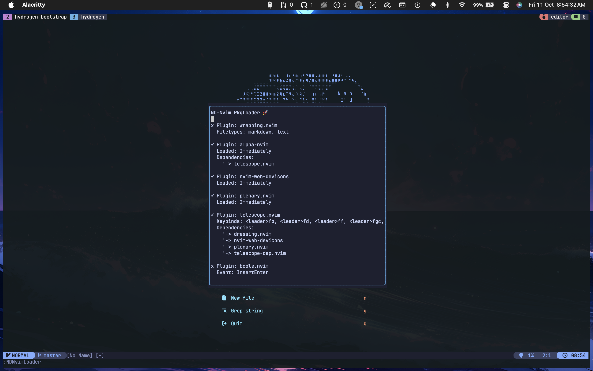

<h1 align='center'>✨ The One Neovim Config to Rule Them All ✨</h1>

<p align="center">
  <b>✨ A highly hackable, lazy-loady, Nixified, language-ready Neovim config ✨</b><br>
  <i>No init.vim. No plugin spaghetti. Just vibes. And Nix.</i>
</p>

<div align='center'>


</div>

## 📸 Screenshot or it didn’t happen

Behold the glorious chaos of productivity.



<details>
<summary>✨ Click for the full flex</summary>

- 🔮 **Auto-summoning Suggestions (CMP Magic)**

  > “I know what you’re typing before you do.”
  > 

- 📝 **Markdown Mode Activated**

  > For when you wanna document your life choices in style.
  > 

- 🔀 **Tmux + Nvim = OTP**

  > Split panes like a hacker in a 90s movie.
  > 

- 📦 **Lazy Loader Command: `:LoaderInfo`**
  > Because knowing which plugin is slacking is self-care.
  > 

</details>

---

## 📚 Lore of the Config

<!--toc:start-->

- [Screenshots](#screenshots)
- [🚀 One Command to Rule Them All](#🚀-one-command-to-rule-them-all)
- [🔥 Features](#🔥-features)
- [🚀 Ready to Go, No Fuss](#🚀-ready-to-go-no-fuss)
- [🛠 Configuration](#🛠-configuration-the-ikea-of-neovim-configs)
  - [📦 Plugin Management](#📦-plugin-management-the-dating-app-for-your-editor)
  - [🔧 Runtime Dependencies](#🔧-runtime-dependencies-the-kitchen-pantry)
  - [🧬 Lua Config](#🧬-lua-config-a-place-for-everything)
- [💻 Terminal Fashion Week](#💻-terminal-fashion-week)
- [🤝 Contributing: Join the Cult](#🤝-contributing-join-the-cult)
- [📜 License](#📜-license)
- [🧙‍♀️ Final Thought](#🧙‍️-final-thought)
<!--toc:end-->

---

## 🚀 One Command to Rule Them All

```bash
nix run github:NewDawn0/nvimConfig
```

That's it. Your terminal's glow-up is complete. Fully armed and operational for JS, TS, Lua, Rust, Markdown, Python, and more.

💡 Works on everything except your grandma's Windows 95 machine.

---

## 🔥 Features

🧞‍♂️ _It’s not bloated, it’s **feature-enhanced**:_

| Category            | Magic                                                                                                                              |
| ------------------- | ---------------------------------------------------------------------------------------------------------------------------------- |
| 🧠 Autocompletion   | `nvim-cmp` + `luasnip`                                                                                                             |
| 🎨 Theming          | [`b16.nvim`](https://github.com/NewDawn0/b16.nvim)                                                                                 |
| 🏗 Build System     | [`build.nvim`](https://github.com/NewDawn0/build.nvim)                                                                             |
| 🧊 Plugin Loader    | [`loader.nvim`](https://github.com/NewDawn0/loader.nvim) like [`lazy.nvim`](https://github.com/folke/lazy.nvim) but nix integrated |
| 📚 LSP & Treesitter | Pre-configured + ready to go                                                                                                       |
| 🧼 Markdown Preview | Yes, it looks good too                                                                                                             |
| 🪟 TMUX Integration | Seamless window movement                                                                                                           |
| 🪄 Keymaps & UX     | Thoughtfully mapped and overridable                                                                                                |

---

## 🚀 Ready to Go, No Fuss

**It just works™. Clone, run, and feel superior to your colleagues in seconds.**

- **Languages?** Yes. All of them that matter. Assembly to Zig with everything tasty in between.

- **LSPs?** Pre-configured because life's too short for `npm install -g typescript-language-server`.

- **Autoformatting & Linting?** Automatically making your code less embarrassing since 2023.

- **Diagnostics?** Shows errors with enough sass to make you actually fix them.

> “It’s like VSCode without the bloat… or JavaScript guilt.”

---

## 🛠 Configuration:

**The IKEA of Neovim Configs**

Everything is customizable. Nothing requires a PhD to understand.

### 📦 Plugin Management:

**The Dating App for Your Editor**

Edit: [`nix/plugins.nix`](./nix/plugins.nix)

Swipe right on the plugins you want. Ghost the ones you don't.

### 🔧 Runtime Dependencies:

**The Kitchen Pantry**

Edit: [`nix/runtime.nix`](./nix/runtime.nix)

Stock it with all the ingredients your code-chef heart desires.

### 🧬 Lua Config:

**A Place for Everything**

```plaintext
nvim/
├── init.lua       # The bouncer that only lets cool modules in
├── lua/
│   ├── cfg/       # Plugin boot camp — configs, setups, discipline
│   ├── util/      # Editor whisperer — options, keymaps, autocommands, user commands
│   └── lib/       # Helper spells — reusable functions, no wand required
```

Meticulously organized like your ex never was.

> "It's not spaghetti code. It's artisan plugin sauce." — Socrates, probably

---

## 🤝 Contributing: Join the Cult

- 💥 Got a cursed config idea? Drop it like it’s hot.
- 🐛 Found a bug or typo? Fix it and ascend to commit history.
- 🧠 Want more languages or formatter chaos? Fork it, PR it, flex it.

> Still avoiding Nix?
> Respect. Chaos is a lifestyle too.

## 📜 License

**MIT** – Use it, break it, fork it. Just don’t sue me if it explodes.

## 🧙‍♀️ Final Thought

> “In the beginning, there was Vim.

> Then Vim said, ‘Let there be Neovim.’

> And the devs saw it, and it was good.” — _The Book of Init, 1:01_
